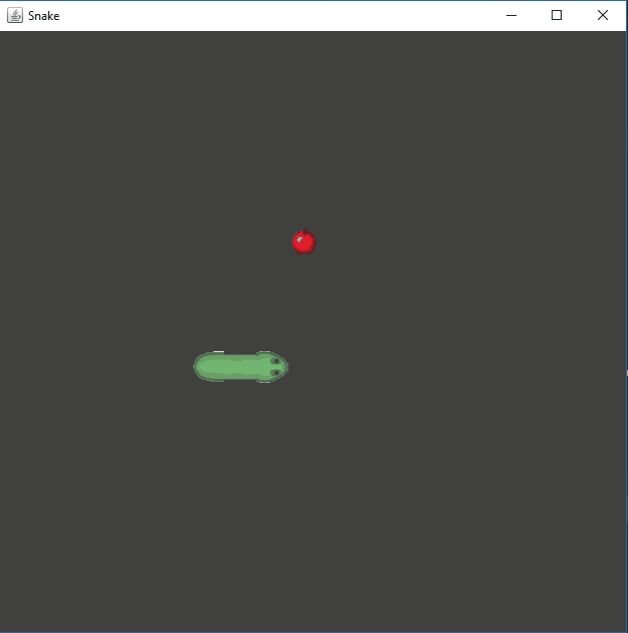

## Snake Game

Приложение _Snake_ было написано для публикации на GitHub и 
на личном сайте ~~(Визитке)~~                  
Суть приложения всем знакома, нужно управлять змейкой, и есть яблоки ~~(Но не есть себя!)~~                                                         
Для отображения объектов были взяты PNG-спрайты из интернет, и элементы библиотеки 
Swing _(JPanel;JFrame)_ и EventListener

### Демонстация:

  

#### В дальнейших планах:

- [X] Внешний вид змейки
    - [X] Добавить спрайт головы змейки
    - [X] Добавить ~~___Г-образный___~~ спрайт змеи во время поворота `Rotation`
    - [X] Изменить направление туловища змеи _(Вертикально/Горизонтально)_ во время движения 
    - [X] В конце должен быть хвост.  `Direction!` 

- [ ] Внешний вид игрового поля и окна приложения
    -[ ] Добавить ~~бордюр~~ границы игрового поля 
    -[ ] Добавить возможность начать игру заново `New Game`